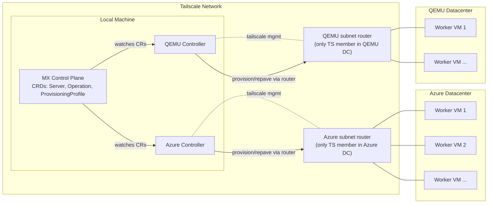

# Stargate - Multi-Cloud Baremetal Kubernetes Provisioning

## Architecture



Only one device per datacenter joins Tailscale as the subnet router; the worker VMs stay on the local subnet behind that router.

### Network Addressing Model (canonical)

- One subnet per datacenter (example Azure: 10.50.<dc>.0/24; QEMU default: 192.168.100.0/24).
- One dedicated router VM per datacenter joins Tailscale and advertises that subnet; workers stay on LAN only.
- Router holds the gateway address (e.g., .1); workers consume .10+. Avoid overlapping subnets across DCs.
- Controllers reach workers through the router over the advertised subnet; workers never join the tailnet.

## Prerequisites

- Docker
- Kind
- kubectl
- Tailscale (installed and authenticated)
- Azure CLI (authenticated)
- Go 1.21+

## Quick Start

### 1. Set Environment Variables

```bash
export TAILSCALE_AUTH_KEY="tskey-auth-..."           # Tailscale auth key for the subnet router (one per DC)
export TAILSCALE_CLIENT_ID="..."                      # Tailscale OAuth client ID (for route approval & cleanup)
export TAILSCALE_CLIENT_SECRET="tskey-client-..."     # Tailscale OAuth client secret (for route approval & cleanup)
export AZURE_SUBSCRIPTION_ID="..."                    # Azure subscription ID
```

> **Note:** `TAILSCALE_CLIENT_ID` and `TAILSCALE_CLIENT_SECRET` are required for automatic subnet route approval via the Tailscale API. Without these, you must manually approve routes in the Tailscale admin console.

### 2. Build All Binaries

```bash
make clean-all && make build
```

### 3. Create Kind Cluster with Tailscale

```bash
./scripts/create-mx-cluster.sh
```

This script:
- Creates a Kind cluster named `stargate-demo`
- Installs Tailscale inside the control-plane container
- Configures the API server to be accessible via Tailscale IP
- Installs Flannel CNI
- Installs Stargate CRDs
- Creates `azure-dc` namespace with required secrets (`azure-ssh-credentials`, `tailscale-auth`)
- Creates default `ProvisioningProfile` (`azure-k8s-worker`) in `azure-dc` namespace

### 4. Provision VMs

You can provision VMs using **Azure** and **local QEMU** providers:

#### Option A: Azure VMs

```bash
# Generate unique deployment number (YYMMDDHHmm format)
export DEPLOY_NUM=$(date +%y%m%d%H%M)

bin/prep-dc-inventory \
  --provider azure \
  --subscription-id "$AZURE_SUBSCRIPTION_ID" \
  --resource-group stargate-vapa-$DEPLOY_NUM \
  --location canadacentral \
  --zone 1 \
  --vnet-name stargate-vnet \
  --vnet-cidr 10.50.0.0/16 \
  --subnet-name stargate-subnet \
  --subnet-cidr 10.50.1.0/24 \
  --router-name stargate-azure-router-$DEPLOY_NUM \
  --vm stargate-azure-vm$DEPLOY_NUM-1 \
  --vm stargate-azure-vm$DEPLOY_NUM-2 \
  --vm stargate-azure-vm$DEPLOY_NUM-3 \
  --vm-size Standard_D2s_v5 \
  --admin-username adminuser \
  --ssh-public-key "$HOME/.ssh/id_rsa.pub" \
  --tailscale-auth-key "$TAILSCALE_AUTH_KEY" \
  --tailscale-client-id "$TAILSCALE_CLIENT_ID" \
  --tailscale-client-secret "$TAILSCALE_CLIENT_SECRET" \
  --namespace azure-dc
```

The `--tailscale-client-id` and `--tailscale-client-secret` flags enable automatic subnet route approval via the Tailscale API. If omitted, routes will be advertised but require manual approval in the admin console.

#### Option B: Local QEMU VMs (requires root and KVM)

```bash
# Generate unique deployment number
export DEPLOY_NUM=$(date +%y%m%d%H%M)

sudo -E bin/prep-dc-inventory \
  --provider qemu \
  --router-name stargate-qemu-router-$DEPLOY_NUM \
  --vm stargate-qemu-vm$DEPLOY_NUM-1 \
  --vm stargate-qemu-vm$DEPLOY_NUM-2 \
  --admin-username ubuntu \
  --ssh-public-key "$HOME/.ssh/id_rsa.pub" \
  --tailscale-auth-key "$TAILSCALE_AUTH_KEY" \
  --tailscale-client-id "$TAILSCALE_CLIENT_ID" \
  --tailscale-client-secret "$TAILSCALE_CLIENT_SECRET" \
  --namespace simulator-dc \
  --qemu-subnet-cidr 192.168.100.0/24 \
  --qemu-cpus 2 \
  --qemu-memory 4096 \
  --qemu-disk 20
```

> **Note:** Use `sudo -E` to preserve environment variables when running as root.

This command:
- Creates a bridge network (192.168.100.0/24) for QEMU VMs
- Provisions a **router VM** that joins Tailscale and advertises the subnet
- Provisions **worker VMs** on the local subnet (no Tailscale, accessed via router)
- Automatically approves subnet routes via Tailscale API
- Verifies connectivity via the router
- Creates `Server` CRs in the `simulator-dc` namespace

### 5. Build and Run Controllers

```bash
make start-controllers
```

This builds `bin/azure-controller` and `bin/qemu-controller`, then starts them (qemu controller runs under sudo). Logs: `/tmp/stargate-azure-controller.log` and `/tmp/stargate-qemu-controller.log`. If sudo prompts, run `sudo -v` first.


### 6. Bootstrap VMs as Kubernetes Workers

Create an `Operation` for each VM to trigger the bootstrap:

#### For Azure VMs (use same `DEPLOY_NUM`):

```bash
for i in 1 2 3; do
kubectl apply -f - <<EOF
apiVersion: stargate.io/v1alpha1
kind: Operation
metadata:
  name: bootstrap-vm$DEPLOY_NUM-$i
  namespace: azure-dc
spec:
  serverRef:
    name: stargate-azure-vm$DEPLOY_NUM-$i
  provisioningProfileRef:
    name: azure-k8s-worker
  operation: repave
EOF
done
```

#### For QEMU VMs:

```bash
for i in 1 2; do
kubectl apply -f - <<EOF
apiVersion: stargate.io/v1alpha1
kind: Operation
metadata:
  name: bootstrap-qemu-vm-$i
  namespace: simulator-dc
spec:
  serverRef:
    name: stargate-qemu-vm-$i
  provisioningProfileRef:
    name: qemu-k8s-worker
  operation: repave
EOF
done
```

### 7. Verify Cluster

```bash
kubectl get nodes -o wide
kubectl get operations -n azure-dc    # For Azure
kubectl get operations -n simulator-dc  # For QEMU
kubectl get servers -n azure-dc       # For Azure
kubectl get servers -n simulator-dc   # For QEMU
```

## Cleanup

### Full Cleanup

Cleans up everything: Kind cluster, Tailscale devices, Azure resource groups, and local processes.

```bash
make clean-all
```

## Custom Resource Definitions (CRDs)

### Server

Represents a physical or virtual machine that can be provisioned.

```yaml
apiVersion: stargate.io/v1alpha1
kind: Server
metadata:
  name: my-server
spec:
  ipv4: 100.x.x.x          # Tailscale IP
  provisioningProfile: azure-k8s-worker
status:
  state: ready             # pending, provisioning, ready, error
  os: k8s-1.34
```

### ProvisioningProfile

Defines how servers should be provisioned.

```yaml
apiVersion: stargate.io/v1alpha1
kind: ProvisioningProfile
metadata:
  name: azure-k8s-worker
spec:
  kubernetesVersion: "1.34"
  sshCredentialsSecretRef: azure-ssh-credentials
  tailscaleAuthKeySecretRef: tailscale-auth
```

### Operation

Triggers a provisioning operation on a server.

```yaml
apiVersion: stargate.io/v1alpha1
kind: Operation
metadata:
  name: bootstrap-my-server
spec:
  serverRef:
    name: my-server
  provisioningProfileRef:
    name: azure-k8s-worker
  operation: repave        # repave is the only supported operation
status:
  phase: Succeeded         # Pending, Running, Succeeded, Failed
  message: "Bootstrap completed successfully"
```
