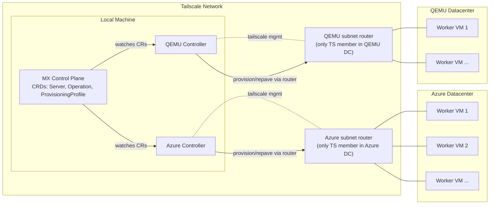

# Stargate - Multi-Cloud Baremetal Kubernetes Provisioning

## Architecture



Only one device per datacenter joins Tailscale as the subnet router; the worker VMs stay on the local subnet behind that router.

### Network Addressing Model (canonical)

- One subnet per datacenter (example Azure: 10.50.<dc>.0/24; QEMU default: 192.168.100.0/24).
- One dedicated router VM per datacenter joins Tailscale and advertises that subnet; workers stay on LAN only.
- Router holds the gateway address (e.g., .1); workers consume .10+. Avoid overlapping subnets across DCs.
- Controllers reach workers through the router over the advertised subnet; workers never join the tailnet.

## Prerequisites

- Docker
- Kind
- kubectl
- Tailscale (installed and authenticated)
- Azure CLI (authenticated)
- Go 1.21+

## Quick Start

### 1. Set Environment Variables

```bash
export TAILSCALE_AUTH_KEY="tskey-auth-..."           # Tailscale auth key for the subnet router (one per DC)
export TAILSCALE_CLIENT_ID="..."                      # Tailscale OAuth client ID (for route approval & cleanup)
export TAILSCALE_CLIENT_SECRET="tskey-client-..."     # Tailscale OAuth client secret (for route approval & cleanup)
export AZURE_SUBSCRIPTION_ID="..."                    # Azure subscription ID
```

> **Note:** `TAILSCALE_CLIENT_ID` and `TAILSCALE_CLIENT_SECRET` are required for automatic subnet route approval via the Tailscale API. Without these, you must manually approve routes in the Tailscale admin console.

### 2. Build All Binaries

```bash
make clean-all && make build
```

### 3. Create Kind Cluster with Tailscale

```bash
./scripts/create-mx-cluster.sh
```

This script:
- Creates a Kind cluster named `stargate-demo`
- Installs Tailscale inside the control-plane container
- Configures the API server to be accessible via Tailscale IP
- Installs Flannel CNI
- Installs Stargate CRDs
- Creates `azure-dc` namespace with required secrets (`azure-ssh-credentials`, `tailscale-auth`)
- Creates default `ProvisioningProfile` (`azure-k8s-worker`) in `azure-dc` namespace

### 4. Provision VMs

You can provision VMs using **Azure** and **local QEMU** providers:

#### Option A: Azure VMs

```bash
# Generate unique deployment number (YYMMDDHHmm format)
export DEPLOY_NUM=$(date +%y%m%d%H%M)

bin/prep-dc-inventory \
  --provider azure \
  --subscription-id "$AZURE_SUBSCRIPTION_ID" \
  --resource-group stargate-vapa-$DEPLOY_NUM \
  --location canadacentral \
  --zone 1 \
  --vnet-name stargate-vnet \
  --vnet-cidr 10.50.0.0/16 \
  --subnet-name stargate-subnet \
  --subnet-cidr 10.50.1.0/24 \
  --router-name stargate-azure-router-$DEPLOY_NUM \
  --vm stargate-azure-vm$DEPLOY_NUM-1 \
  --vm stargate-azure-vm$DEPLOY_NUM-2 \
  --vm stargate-azure-vm$DEPLOY_NUM-3 \
  --vm-size Standard_D2s_v5 \
  --admin-username adminuser \
  --ssh-public-key "$HOME/.ssh/id_rsa.pub" \
  --tailscale-auth-key "$TAILSCALE_AUTH_KEY" \
  --tailscale-client-id "$TAILSCALE_CLIENT_ID" \
  --tailscale-client-secret "$TAILSCALE_CLIENT_SECRET" \
  --namespace azure-dc
```

The `--tailscale-client-id` and `--tailscale-client-secret` flags enable automatic subnet route approval via the Tailscale API. If omitted, routes will be advertised but require manual approval in the admin console.

#### Option B: Local QEMU VMs (requires root and KVM)

```bash
# Generate unique deployment number
export DEPLOY_NUM=$(date +%y%m%d%H%M)

sudo -E bin/prep-dc-inventory \
  --provider qemu \
  --router-name stargate-qemu-router-$DEPLOY_NUM \
  --vm stargate-qemu-vm$DEPLOY_NUM-1 \
  --vm stargate-qemu-vm$DEPLOY_NUM-2 \
  --admin-username ubuntu \
  --ssh-public-key "$HOME/.ssh/id_rsa.pub" \
  --tailscale-auth-key "$TAILSCALE_AUTH_KEY" \
  --tailscale-client-id "$TAILSCALE_CLIENT_ID" \
  --tailscale-client-secret "$TAILSCALE_CLIENT_SECRET" \
  --namespace simulator-dc \
  --qemu-subnet-cidr 192.168.100.0/24 \
  --qemu-cpus 2 \
  --qemu-memory 4096 \
  --qemu-disk 20
```

> **Note:** Use `sudo -E` to preserve environment variables when running as root.

This command:
- Creates a bridge network (192.168.100.0/24) for QEMU VMs
- Provisions a **router VM** that joins Tailscale and advertises the subnet
- Provisions **worker VMs** on the local subnet (no Tailscale, accessed via router)
- Automatically approves subnet routes via Tailscale API
- Verifies connectivity via the router
- Creates `Server` CRs in the `simulator-dc` namespace

### 5. Build and Run Controllers

```bash
make start-controllers
```

This builds `bin/azure-controller` and `bin/qemu-controller`, then starts them (qemu controller runs under sudo). Logs: `/tmp/stargate-azure-controller.log` and `/tmp/stargate-qemu-controller.log`. If sudo prompts, run `sudo -v` first.


### 6. Bootstrap VMs as Kubernetes Workers

Create an `Operation` for each VM to trigger the bootstrap:

#### For Azure VMs:

```bash
for server in $(kubectl get servers -n azure-dc -o jsonpath='{.items[*].metadata.name}'); do
kubectl apply -f - <<EOF
apiVersion: stargate.io/v1alpha1
kind: Operation
metadata:
  name: bootstrap-${server}
  namespace: azure-dc
spec:
  serverRef:
    name: ${server}
  provisioningProfileRef:
    name: azure-k8s-worker
  operation: repave
EOF
done
```

#### For QEMU VMs:

```bash
for server in $(kubectl get servers -n simulator-dc -o jsonpath='{.items[*].metadata.name}'); do
kubectl apply -f - <<EOF
apiVersion: stargate.io/v1alpha1
kind: Operation
metadata:
  name: bootstrap-${server}
  namespace: simulator-dc
spec:
  serverRef:
    name: ${server}
  provisioningProfileRef:
    name: qemu-k8s-worker
  operation: repave
EOF
done
```

### 7. Verify Cluster

```bash
kubectl get nodes -o wide
kubectl get operations -n azure-dc    # For Azure
kubectl get operations -n simulator-dc  # For QEMU
kubectl get servers -n azure-dc       # For Azure
kubectl get servers -n simulator-dc   # For QEMU
```

## Deploy MX Cluster in Azure

The `mx-azure` tool provides a standalone way to deploy an MX cluster directly in Azure with a single VM that bootstraps as a Kubernetes control plane.

### Prerequisites

- Azure CLI authenticated (`az login`)
- Tailscale installed and authenticated
- SSH key pair (`~/.ssh/id_rsa.pub`)

### 1. Set Environment Variables

```bash
export AZURE_SUBSCRIPTION_ID="..."           # Azure subscription ID
export TAILSCALE_AUTH_KEY="tskey-auth-..."   # Tailscale auth key for the VM
```

### 2. Build the Tool

```bash
make build
```

### 3. Provision the MX Cluster

```bash
bin/mx-azure provision \
  --subscription-id "$AZURE_SUBSCRIPTION_ID" \
  --location canadacentral \
  --zone 1 \
  --resource-group stargate-vapa-mx-cluster \
  --vnet-name mx-vnet \
  --vnet-address-space 10.0.0.0/16 \
  --subnet-name mx-subnet \
  --subnet-prefix 10.0.1.0/24 \
  --vm-name stargate-vapa-mx-cp \
  --vm-size Standard_D2s_v5 \
  --admin-username azureuser \
  --ssh-public-key-path ~/.ssh/id_rsa.pub \
  --tailscale-auth-key "$TAILSCALE_AUTH_KEY" \
  --kubernetes-version 1.29
```

This command:
- Creates a resource group with VNet, subnet, NSG, and public IP
- Provisions a VM with cloud-init that:
  - Installs Tailscale and joins your tailnet
  - Installs kubeadm, kubelet, and kubectl
  - Bootstraps a single-node Kubernetes cluster
- Adds an SSH config entry for easy access via Tailscale

### 4. Verify the Cluster

Wait for the VM to appear in [Tailscale Admin Console](https://login.tailscale.com/admin/machines), then verify:

```bash
# Check bootstrap logs
tailscale ssh azureuser@stargate-vapa-mx-cp -- sudo tail -f /var/log/mx-bootstrap.log

# Verify Kubernetes is ready
tailscale ssh azureuser@stargate-vapa-mx-cp -- sudo kubectl get nodes
```

### 5. Access the Cluster Locally (Optional)

Copy the kubeconfig to your local machine:

```bash
tailscale ssh azureuser@stargate-vapa-mx-cp -- sudo cat /etc/kubernetes/admin.conf > ~/.kube/mx-azure.conf
export KUBECONFIG=~/.kube/mx-azure.conf
kubectl get nodes
```

### 6. Add Worker Nodes to the MX Cluster

You can add worker nodes using `prep-dc-inventory` and the azure-controller.

#### 6a. Provision Worker VMs

This command provisions worker VMs and automatically installs Stargate CRDs on the MX cluster:

```bash
export DEPLOY_NUM=$(date +%y%m%d%H%M)

bin/prep-dc-inventory \
  --provider azure \
  --subscription-id "$AZURE_SUBSCRIPTION_ID" \
  --resource-group stargate-vapa-workers-$DEPLOY_NUM \
  --location canadacentral \
  --zone 1 \
  --vnet-name stargate-vnet \
  --vnet-cidr 10.50.0.0/16 \
  --subnet-name stargate-subnet \
  --subnet-cidr 10.50.1.0/24 \
  --router-name stargate-azure-router-$DEPLOY_NUM \
  --vm stargate-azure-vm$DEPLOY_NUM-1 \
  --vm stargate-azure-vm$DEPLOY_NUM-2 \
  --vm stargate-azure-vm$DEPLOY_NUM-3 \
  --vm-size Standard_D2s_v5 \
  --admin-username adminuser \
  --ssh-public-key "$HOME/.ssh/id_rsa.pub" \
  --tailscale-auth-key "$TAILSCALE_AUTH_KEY" \
  --tailscale-client-id "$TAILSCALE_CLIENT_ID" \
  --tailscale-client-secret "$TAILSCALE_CLIENT_SECRET" \
  --kubeconfig ~/.kube/mx-azure.conf \
  --namespace azure-dc
```

#### 6b. Create Secrets and ProvisioningProfile

```bash
# Create secrets for SSH access
kubectl create secret generic azure-ssh-credentials \
  --namespace azure-dc \
  --from-literal=username=adminuser \
  --from-file=privateKey=$HOME/.ssh/id_rsa

# Create ProvisioningProfile
kubectl apply -f - <<EOF
apiVersion: stargate.io/v1alpha1
kind: ProvisioningProfile
metadata:
  name: azure-k8s-worker
  namespace: azure-dc
spec:
  kubernetesVersion: "1.29"
  containerRuntime: containerd
  sshCredentialsSecretRef: azure-ssh-credentials
  adminUsername: adminuser
EOF
```

#### 6c. Start the Controller in Tailscale Mode

Get the control plane's Tailscale IP:

```bash
CP_IP=$(tailscale ssh azureuser@stargate-vapa-mx-cp -- tailscale ip -4)
echo "Control plane IP: $CP_IP"
```

Start the controller:

```bash
KUBECONFIG=~/.kube/mx-azure.conf bin/azure-controller \
  --control-plane-mode=tailscale \
  --control-plane-ip=$CP_IP \
  --control-plane-hostname=stargate-vapa-mx-cp \
  --control-plane-ssh-user=azureuser \
  --admin-username=adminuser
```

#### 6d. Bootstrap Workers

Create Operations to trigger the bootstrap:

```bash
for server in $(kubectl get servers -n azure-dc -o jsonpath='{.items[*].metadata.name}'); do
  kubectl apply -f - <<EOF
apiVersion: stargate.io/v1alpha1
kind: Operation
metadata:
  name: bootstrap-${server}
  namespace: azure-dc
spec:
  serverRef:
    name: ${server}
  provisioningProfileRef:
    name: azure-k8s-worker
  operation: repave
EOF
done
```

#### 6e. Verify Workers Joined

```bash
kubectl get nodes -o wide
kubectl get operations -n azure-dc
kubectl get servers -n azure-dc
```

### 7. Check Cluster Status

```bash
bin/mx-azure status \
  --subscription-id "$AZURE_SUBSCRIPTION_ID" \
  --resource-group stargate-vapa-mx-cluster
```

### 8. Destroy the Cluster

```bash
bin/mx-azure destroy \
  --subscription-id "$AZURE_SUBSCRIPTION_ID" \
  --resource-group stargate-vapa-mx-cluster \
  --yes
```

## Add External Workers to an Existing AKS Cluster

You can add external VMs as worker nodes to an existing AKS cluster. The controller automatically:
- Detects the API server URL from kubeconfig
- Extracts the CA certificate from kubeconfig  
- Creates ServiceAccount tokens programmatically for each node bootstrap

### Prerequisites

- An existing AKS cluster
- Azure CLI authenticated (`az login`)
- Tailscale installed and authenticated
- SSH key pair for worker VM access

### 1. Get AKS Cluster Kubeconfig

```bash
# Set your AKS cluster details
export AKS_RESOURCE_GROUP="your-aks-resource-group"
export AKS_CLUSTER_NAME="your-aks-cluster-name"
export AZURE_SUBSCRIPTION_ID=$(az account show --query id -o tsv)

# Get admin kubeconfig (saves to ~/.kube/config or use --file to save elsewhere)
az aks get-credentials --resource-group $AKS_RESOURCE_GROUP --name $AKS_CLUSTER_NAME --admin

# If you saved kubeconfig to a different file, set KUBECONFIG
# export KUBECONFIG=~/.kube/your-aks-cluster.conf
```

### 2. Create ServiceAccount for Node Bootstrap

The controller uses the Kubernetes TokenRequest API to generate short-lived tokens for each node bootstrap.
Create the ServiceAccount that will be used:

```bash
kubectl apply -f - <<EOF
apiVersion: v1
kind: ServiceAccount
metadata:
  name: kubelet-bootstrap
  namespace: kube-system
EOF
```

### 3. Create RBAC for Node Bootstrap

```bash
# Grant the ServiceAccount permissions to bootstrap nodes
kubectl apply -f - <<EOF
apiVersion: rbac.authorization.k8s.io/v1
kind: ClusterRoleBinding
metadata:
  name: kubelet-bootstrap
roleRef:
  apiGroup: rbac.authorization.k8s.io
  kind: ClusterRole
  name: system:node-bootstrapper
subjects:
- kind: ServiceAccount
  name: kubelet-bootstrap
  namespace: kube-system
---
apiVersion: rbac.authorization.k8s.io/v1
kind: ClusterRoleBinding
metadata:
  name: kubelet-bootstrap-node-autoapprove
roleRef:
  apiGroup: rbac.authorization.k8s.io
  kind: ClusterRole
  name: system:certificates.k8s.io:certificatesigningrequests:nodeclient
subjects:
- kind: ServiceAccount
  name: kubelet-bootstrap
  namespace: kube-system
EOF
```

### 4. Deploy Tailscale Subnet Router in AKS (Optional)

If you want to access the AKS pod network from your Tailscale network:

```bash
# Create namespace and auth secret
kubectl create namespace tailscale
kubectl create secret generic tailscale-auth \
  --namespace tailscale \
  --from-literal=authkey="$TAILSCALE_AUTH_KEY"

# Get the pod and service CIDRs
POD_CIDR=$(az aks show -g $AKS_RESOURCE_GROUP -n $AKS_CLUSTER_NAME --query "networkProfile.podCidr" -o tsv)
SERVICE_CIDR=$(az aks show -g $AKS_RESOURCE_GROUP -n $AKS_CLUSTER_NAME --query "networkProfile.serviceCidr" -o tsv)
echo "Pod CIDR: $POD_CIDR, Service CIDR: $SERVICE_CIDR"

# Deploy Tailscale subnet router
cat <<EOF | kubectl apply -f -
apiVersion: apps/v1
kind: Deployment
metadata:
  name: tailscale-router
  namespace: tailscale
spec:
  replicas: 1
  selector:
    matchLabels:
      app: tailscale-router
  template:
    metadata:
      labels:
        app: tailscale-router
    spec:
      serviceAccountName: default
      containers:
      - name: tailscale
        image: tailscale/tailscale:latest
        securityContext:
          capabilities:
            add: ["NET_ADMIN"]
        env:
        - name: TS_AUTHKEY
          valueFrom:
            secretKeyRef:
              name: tailscale-auth
              key: authkey
        - name: TS_ROUTES
          value: "${POD_CIDR},${SERVICE_CIDR}"
        - name: TS_ACCEPT_ROUTES
          value: "true"
        - name: TS_USERSPACE
          value: "false"
EOF
```

### 5. Provision AKS Router VM

First, deploy a router VM inside the AKS VNet. This VM:
- Joins Tailscale and advertises routes to the worker VNet
- Acts as an SSH jump host to reach worker VMs
- Enables the controller to bootstrap workers via SSH proxy

```bash
export DEPLOY_NUM=$(date +%y%m%d%H%M)

bin/prep-dc-inventory \
  --provider azure \
  --role aks-router \
  --subscription-id "$AZURE_SUBSCRIPTION_ID" \
  --aks-cluster-name "$AKS_CLUSTER_NAME" \
  --aks-cluster-rg "$AKS_RESOURCE_GROUP" \
  --aks-router-name stargate-aks-router-$DEPLOY_NUM \
  --aks-subnet-cidr "10.237.0.0/24" \
  --admin-username adminuser \
  --ssh-public-key "$HOME/.ssh/id_rsa.pub" \
  --location canadacentral
```

This command:
- Auto-detects the AKS VNet and managed resource group (MC_*)
- Creates a new subnet (10.237.0.0/24) in the AKS VNet for the router
- Provisions a router VM with Tailscale that advertises routes
- Creates a route table for traffic from AKS to worker VNets

### 6. Provision Worker VMs

Now provision the worker VMs in a separate VNet:

```bash
bin/prep-dc-inventory \
  --provider azure \
  --subscription-id "$AZURE_SUBSCRIPTION_ID" \
  --resource-group stargate-vapa-aks-workers-$DEPLOY_NUM \
  --location canadacentral \
  --zone 1 \
  --vnet-name stargate-aks-vnet \
  --vnet-cidr 10.70.0.0/16 \
  --subnet-name stargate-aks-subnet \
  --subnet-cidr 10.70.1.0/24 \
  --router-name stargate-dc-router-$DEPLOY_NUM \
  --vm stargate-aks-vm$DEPLOY_NUM-1 \
  --vm stargate-aks-vm$DEPLOY_NUM-2 \
  --vm-size Standard_D2s_v5 \
  --admin-username adminuser \
  --ssh-public-key "$HOME/.ssh/id_rsa.pub" \
  --aks-cluster-name "$AKS_CLUSTER_NAME" \
  --aks-cluster-rg "$AKS_RESOURCE_GROUP" \
  --tailscale-auth-key "$TAILSCALE_AUTH_KEY" \
  --tailscale-client-id "$TAILSCALE_CLIENT_ID" \
  --tailscale-client-secret "$TAILSCALE_CLIENT_SECRET" \
  --kubeconfig ~/.kube/config \
  --namespace aks-workers
```

### 7. Create Secrets and ProvisioningProfile

```bash
# Create namespace
kubectl create namespace aks-workers

# Create SSH credentials secret
kubectl create secret generic aks-ssh-credentials \
  --namespace aks-workers \
  --from-literal=username=adminuser \
  --from-file=privateKey=$HOME/.ssh/id_rsa

# Create ProvisioningProfile
kubectl apply -f - <<EOF
apiVersion: stargate.io/v1alpha1
kind: ProvisioningProfile
metadata:
  name: aks-worker
  namespace: aks-workers
spec:
  kubernetesVersion: "1.29"
  containerRuntime: containerd
  sshCredentialsSecretRef: aks-ssh-credentials
  adminUsername: adminuser
EOF
```

### 8. Start the Controller in AKS Mode

The controller automatically detects the API server and CA certificate from the kubeconfig,
and creates ServiceAccount tokens for each node bootstrap.

```bash
bin/azure-controller \
  --control-plane-mode=aks \
  --aks-cluster-name="$AKS_CLUSTER_NAME" \
  --aks-resource-group="$AKS_RESOURCE_GROUP" \
  --aks-subscription-id="$AZURE_SUBSCRIPTION_ID" \
  --aks-vm-resource-group="stargate-vapa-aks-workers-$DEPLOY_NUM" \
  --aks-api-server-private-ip="$AKS_ROUTER_PRIVATE_IP" \
  --dc-router-tailscale-ip="$DC_ROUTER_TAILSCALE_IP" \
  --azure-route-table-name="stargate-workers-rt" \
  --admin-username=adminuser &
```

#### Routing Configuration Flags

When operating in AKS mode with external datacenter nodes, the controller can automatically configure routing:

| Flag | Description |
|------|-------------|
| `--dc-router-tailscale-ip` | Tailscale IP of the DC router. The controller will SSH to this router to add routes for node pod CIDRs. |
| `--aks-router-tailscale-ip` | Tailscale IP of the AKS router (for future use). |
| `--azure-route-table-name` | Name of the Azure route table where pod CIDR routes should be added. |
| `--azure-vnet-name` | Azure VNet name containing the subnets. |
| `--azure-subnet-name` | Azure subnet name where AKS nodes reside. |
| `--aks-api-server-private-ip` | Private IP of the AKS router (used as next-hop for Azure routes). |

These flags enable automatic configuration of:
1. **DC Router Routes**: Adds `ip route add <pod-cidr> via <node-ip>` on the DC router for each bootstrapped node
2. **Azure Route Tables**: Creates routes in Azure to direct pod CIDR traffic to the AKS router, which forwards via Tailscale to the DC router

### 9. Bootstrap Workers

```bash
for server in $(kubectl get servers -n aks-workers -o jsonpath='{.items[*].metadata.name}'); do
  kubectl apply -f - <<EOF
apiVersion: stargate.io/v1alpha1
kind: Operation
metadata:
  name: bootstrap-${server}
  namespace: aks-workers
spec:
  serverRef:
    name: ${server}
  provisioningProfileRef:
    name: aks-worker
  operation: repave
EOF
done
```

### 10. Verify Workers Joined

```bash
kubectl get nodes -o wide
kubectl get operations -n aks-workers
```

The external VMs should appear as nodes in your AKS cluster with labels indicating they are managed by Stargate.

## Cleanup

### Full Cleanup

Cleans up everything: Kind cluster, Tailscale devices, Azure resource groups, and local processes.

```bash
make clean-all
```

## Custom Resource Definitions (CRDs)

### Server

Represents a physical or virtual machine that can be provisioned.

```yaml
apiVersion: stargate.io/v1alpha1
kind: Server
metadata:
  name: my-server
spec:
  ipv4: 100.x.x.x          # Tailscale IP
  provisioningProfile: azure-k8s-worker
status:
  state: ready             # pending, provisioning, ready, error
  os: k8s-1.34
```

### ProvisioningProfile

Defines how servers should be provisioned.

```yaml
apiVersion: stargate.io/v1alpha1
kind: ProvisioningProfile
metadata:
  name: azure-k8s-worker
spec:
  kubernetesVersion: "1.34"
  sshCredentialsSecretRef: azure-ssh-credentials
  tailscaleAuthKeySecretRef: tailscale-auth
```

### Operation

Triggers a provisioning operation on a server.

```yaml
apiVersion: stargate.io/v1alpha1
kind: Operation
metadata:
  name: bootstrap-my-server
spec:
  serverRef:
    name: my-server
  provisioningProfileRef:
    name: azure-k8s-worker
  operation: repave        # repave is the only supported operation
status:
  phase: Succeeded         # Pending, Running, Succeeded, Failed
  message: "Bootstrap completed successfully"
```
