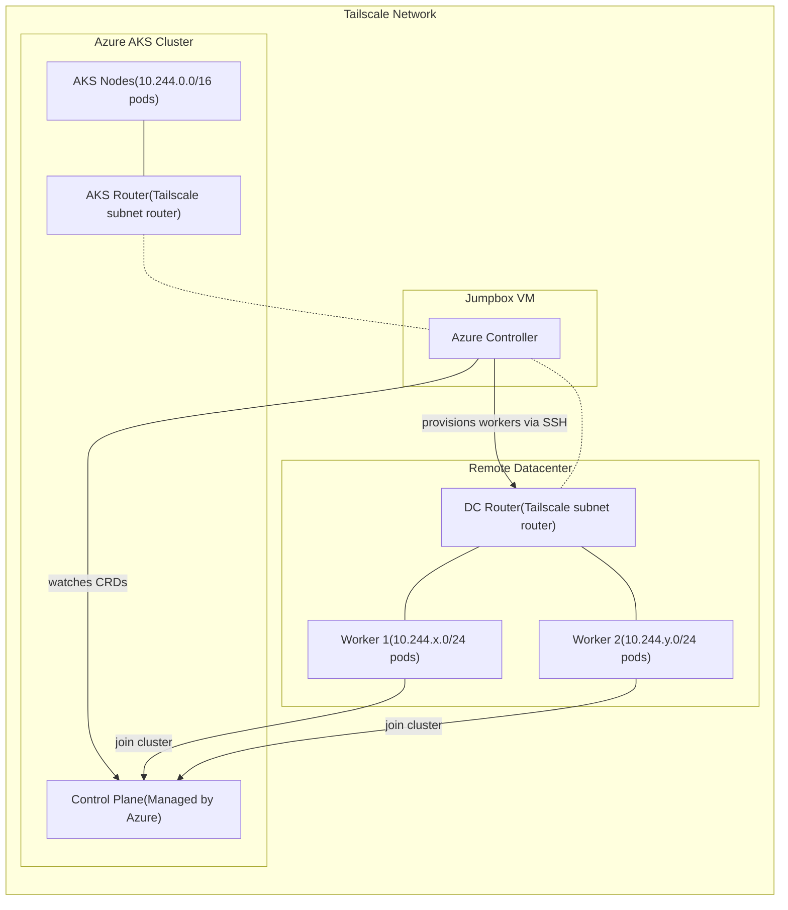

# Stargate - Multi-Cloud Baremetal Kubernetes Provisioning

Stargate enables provisioning baremetal or VM-based Kubernetes workers across multiple datacenters and joining them to a centralized AKS control plane. Workers in remote datacenters communicate with AKS via Tailscale subnet routers, enabling seamless cross-network pod connectivity.

## Features

- **Multi-Datacenter Worker Provisioning**: Bootstrap bare-metal or VM workers in remote datacenters as Kubernetes nodes, joining them to a managed AKS control plane
- **Declarative Infrastructure**: Use Kubernetes CRDs (Server, Operation, ProvisioningProfile) to define and manage infrastructure as code
- **Automatic Route Reconciliation**: The Azure controller continuously syncs routes between Azure VNets, Tailscale, and Kubernetes to ensure pod-to-pod connectivity
- **Cilium CNI Integration**: Works with AKS Cilium overlay networking for scalable pod networking across datacenters
- **TLS Bootstrap**: Workers automatically bootstrap with proper certificates using Kubernetes TLS bootstrap flow

## How It Works

### Route Reconciliation

The Azure controller performs continuous route reconciliation across three layers:

1. **Azure VNet Route Tables**: Maintains routes in the AKS VNet route table so that traffic destined for DC worker pod CIDRs (e.g., 10.244.55.0/24) is forwarded to the AKS router VM, which tunnels it over Tailscale to the DC router.

2. **Tailscale Subnet Routes**: Automatically approves and manages Tailscale subnet routes via the Tailscale API. The AKS router advertises AKS pod/service CIDRs, while the DC router advertises the worker subnet and worker pod CIDRs.

3. **Kubernetes Node PodCIDRs**: Patches CiliumNode resources with correct podCIDR allocations so Cilium knows how to route traffic to DC workers. Each worker gets a unique /24 from the 10.244.0.0/16 range.

This three-layer sync ensures that:
- Pods on AKS nodes can reach pods on DC workers
- Pods on DC workers can reach pods on AKS nodes  
- Pods on DC workers can reach each other
- All routing is automatic and self-healing

## Architecture



### Key Concepts

- **AKS Control Plane**: Managed Kubernetes control plane in Azure
- **AKS Router**: VM in AKS VNet that joins Tailscale and advertises AKS pod/service CIDRs
- **Jumpbox**: VM outside of AKS and DC that runs the Azure controller, connected to both networks via Tailscale
- **DC Router**: VM in remote datacenter that joins Tailscale and advertises worker subnet
- **Workers**: VMs provisioned via Stargate CRDs, bootstrap as Kubernetes nodes

### Network Addressing

| Component | CIDR | Description |
|-----------|------|-------------|
| AKS Pods | 10.244.0.0/16 | Pod network (Cilium overlay) |
| AKS Services | 10.0.0.0/16 | Service ClusterIP range |
| AKS VNet | 10.224.0.0/12 | Azure VNet address space |
| DC Workers | 10.50.1.0/24 | Worker VM subnet |
| Worker Pods | 10.244.50-69.0/24 | Per-worker pod CIDRs |

## Prerequisites

- Azure CLI (authenticated via `az login`)
- kubectl
- Tailscale (installed and authenticated)
- Go 1.21+
- SSH key pair (`~/.ssh/id_rsa`)

### Required Environment Variables

```bash
export TAILSCALE_AUTH_KEY="tskey-auth-..."           # Tailscale auth key for routers
export TAILSCALE_CLIENT_ID="..."                      # Tailscale OAuth client ID
export TAILSCALE_CLIENT_SECRET="tskey-client-..."     # Tailscale OAuth client secret
export TAILSCALE_API_KEY="tsapi-..."                  # Tailscale API key (for cleanup)
```

> **Note:** Generate `TAILSCALE_API_KEY` at https://login.tailscale.com/admin/settings/keys

## Quick Start

### Option 1: Automated Deployment (Recommended)

Deploy a complete E2E cluster with one command:

```bash
# Build binaries
make build

# Deploy cluster (creates AKS + 2 DC workers)
./scripts/deploy-aks-e2e.sh stargate-aks-e2e-1 canadacentral
```

This script:
1. Creates an AKS cluster with Cilium CNI
2. Provisions an AKS router (Tailscale subnet router in AKS VNet)
3. Creates a DC resource group with router + worker VMs
4. Configures Azure route tables for bidirectional pod routing
5. Bootstraps workers as Kubernetes nodes
6. Deploys Goldpinger for connectivity testing

**Cleanup:**

```bash
./scripts/cleanup-aks-e2e.sh stargate-aks-e2e-1
```

### Option 2: Step-by-Step Deployment

For detailed manual deployment, follow [docs/deployment-log-e2e-11.md](docs/deployment-log-e2e-11.md).

## Stargate CRDs

Stargate uses three Custom Resource Definitions:

### Server

Represents a baremetal or VM server in a datacenter:

```yaml
apiVersion: stargate.io/v1alpha1
kind: Server
metadata:
  name: worker-1
  namespace: azure-dc
spec:
  hostname: worker-1
  ipAddress: 10.50.1.5
  macAddress: "60:45:bd:5c:3f:6f"
  routerIP: 100.79.116.34  # Tailscale IP of DC router
```

### ProvisioningProfile

Defines how to provision a server as a Kubernetes worker:

```yaml
apiVersion: stargate.io/v1alpha1
kind: ProvisioningProfile
metadata:
  name: azure-k8s-worker
  namespace: azure-dc
spec:
  kubernetesVersion: "1.33"
  containerRuntime: containerd
  sshCredentialsSecretRef: azure-ssh-credentials
  tailscaleAuthKeySecretRef: tailscale-auth
  adminUsername: ubuntu
```

### Operation

Triggers an action on a server (e.g., repave):

```yaml
apiVersion: stargate.io/v1alpha1
kind: Operation
metadata:
  name: worker-1-repave
  namespace: azure-dc
spec:
  serverRef:
    name: worker-1
  provisioningProfileRef:
    name: azure-k8s-worker
  operation: repave
```

## Tools

### prep-dc-inventory

Provisions infrastructure for AKS integration:

```bash
# Provision AKS router (Tailscale subnet router in AKS VNet)
./bin/prep-dc-inventory \
  -role aks-router \
  -resource-group myaks-rg \
  -aks-cluster-name myaks \
  -aks-router-name myaks-router \
  -aks-subnet-cidr 10.237.0.0/24 \
  -location canadacentral

# Provision DC infrastructure (router + workers)
./bin/prep-dc-inventory \
  -role dc \
  -resource-group myaks-dc \
  -aks-cluster-name myaks \
  -router-name myaks-dc-router \
  -vm myaks-worker-1 \
  -vm myaks-worker-2 \
  -location canadacentral
```

### azure-controller

Controller that watches Operation CRDs and provisions workers:

```bash
./bin/azure-controller \
  -control-plane-mode aks \
  -enable-route-sync \
  -aks-api-server "https://myaks.hcp.canadacentral.azmk8s.io:443" \
  -aks-cluster-name myaks \
  -aks-resource-group myaks-rg \
  -aks-node-resource-group MC_myaks-rg_myaks_canadacentral \
  -aks-subscription-id $SUBSCRIPTION_ID \
  -aks-vm-resource-group myaks-dc \
  -dc-router-tailscale-ip 100.x.x.x \
  -aks-router-tailscale-ip 100.y.y.y \
  -aks-router-private-ip 10.237.0.4 \
  -azure-vnet-name aks-vnet-xxxxx \
  -dc-subnet-cidr 10.50.0.0/16
```

**Controller Flags:**

| Flag | Description |
|------|-------------|
| `-control-plane-mode` | `aks` or `self-hosted` |
| `-enable-route-sync` | Enable Azure route table sync |
| `-aks-api-server` | AKS API server URL |
| `-aks-cluster-name` | AKS cluster name |
| `-aks-resource-group` | AKS cluster resource group |
| `-aks-node-resource-group` | AKS managed resource group (MC_*) |
| `-aks-vm-resource-group` | DC worker VMs resource group |
| `-dc-router-tailscale-ip` | DC router Tailscale IP |
| `-aks-router-tailscale-ip` | AKS router Tailscale IP |
| `-aks-router-private-ip` | AKS router private IP (route next hop) |
| `-azure-vnet-name` | AKS VNet name |
| `-dc-subnet-cidr` | DC network CIDR |

## Connectivity Verification

After deployment, use Goldpinger to verify pod-to-pod connectivity:

```bash
# Port-forward to Goldpinger
kubectl port-forward -n goldpinger svc/goldpinger 8080:8080 &

# Check connectivity
curl -s http://localhost:8080/check_all | jq '.responses | to_entries[] | "\(.key) -> OK: \(.value.OK)"'
```

Expected output shows all pods can reach each other:
```
"goldpinger-xxx -> OK: true"
"goldpinger-yyy -> OK: true"
"goldpinger-zzz -> OK: true"
"goldpinger-www -> OK: true"
```

## Development

### Build

```bash
make build          # Build all binaries
make clean-all      # Clean and rebuild
```

### Test

```bash
make test           # Run unit tests
```

### Project Structure

```
├── api/v1alpha1/          # CRD type definitions
├── cmd/
│   ├── azure/             # Azure CLI tool
│   ├── azure-controller/  # Main controller binary
│   ├── infra-prep/        # prep-dc-inventory tool
│   ├── qemu-controller/   # QEMU VM controller
│   └── simulator/         # Local simulator
├── config/
│   ├── crd/bases/         # CRD manifests
│   └── samples/           # Sample resources
├── controller/            # Controller implementations
├── docs/                  # Deployment logs and documentation
├── pkg/
│   ├── infra/providers/   # Infrastructure providers (Azure, QEMU)
│   ├── qemu/              # QEMU VM management
│   └── tailscale/         # Tailscale API client
└── scripts/               # Deployment and cleanup scripts
```

## Troubleshooting

### Workers not joining cluster

1. Check controller logs: `tail -f /tmp/azure-controller.log`
2. Verify SSH connectivity: `ssh -J ubuntu@<dc-router-ts-ip> ubuntu@10.50.1.5`
3. Check Operation status: `kubectl get operations -n azure-dc`

### Pod connectivity issues

1. Verify routes: `az network route-table route list -g MC_xxx --route-table-name stargate-workers-rt -o table`
2. Check Tailscale routes: `tailscale status`
3. Test from worker: `ssh worker-1 -- ping <aks-pod-ip>`

### Tailscale routes not approved

Routes should auto-approve via OAuth. If not:
1. Check `TAILSCALE_CLIENT_ID` and `TAILSCALE_CLIENT_SECRET` are set
2. Manually approve in [Tailscale Admin Console](https://login.tailscale.com/admin/machines)

## License

MIT
