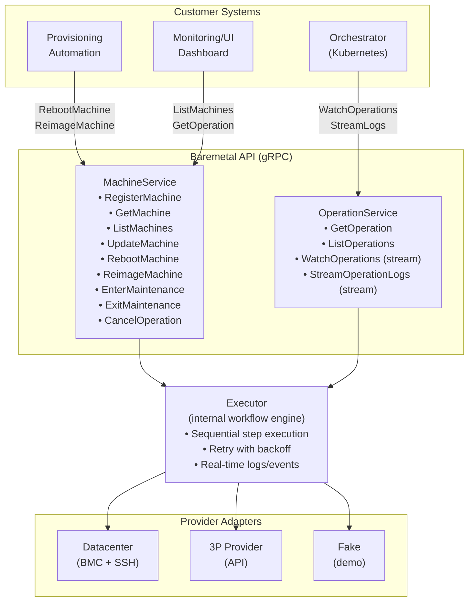
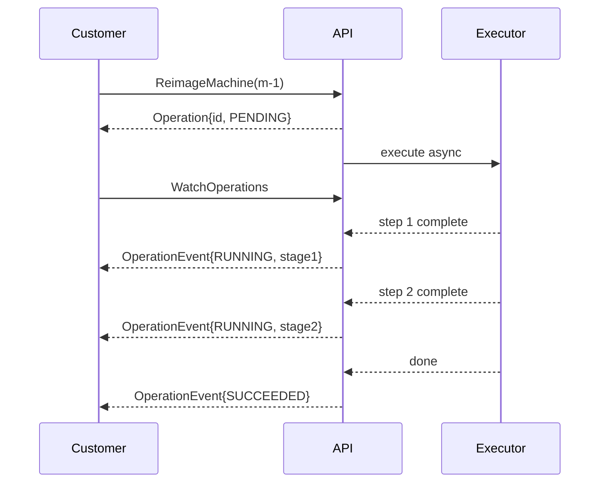
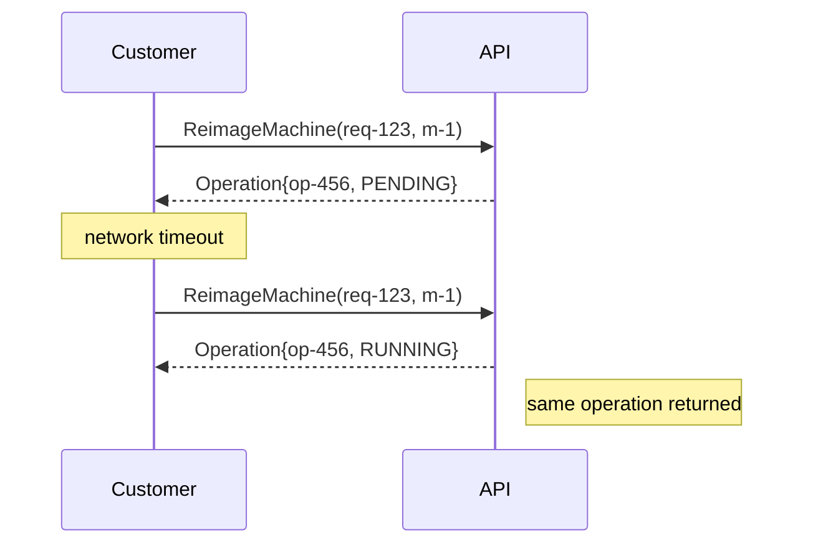
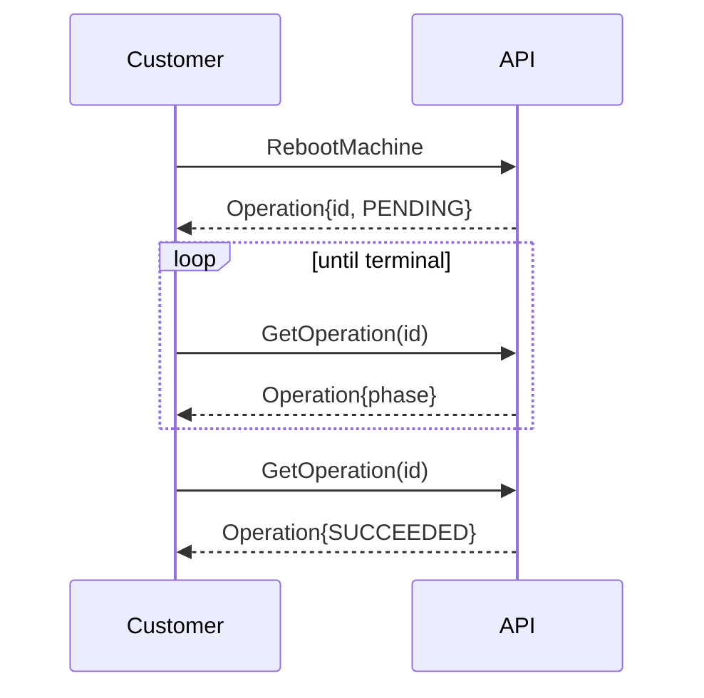

# Bare Metal Provisioning API v1 (gRPC)

## Summary
A minimal, customer-facing gRPC API for managing bare-metal inventory and long-running operations (repave, reboot, maintenance) across multiple providers. The API focuses on **what** happens (operation type, machine, phase, result) while the internal workflow engine (plans, steps) is hidden from SDK consumers.

## Why this exists
We need a single inventory and operations surface that works across:
- Datacenters we fully control
- Third-party bare-metal providers

The API must support asynchronous operations with observable progress and idempotent retries, while remaining provider-agnostic.

## Goals
- Minimal gRPC API usable by other workstreams
- Async, idempotent operations with observable state (phase + logs)
- Provider-agnostic adapters using capability-based interfaces
- Hybrid lifecycle: explicit phase + derived effective_state
- **Internal workflow engine**: plans/steps are NOT exposed in SDK; server-side only

## Non-goals (v1)
- Full IPAM/network modeling like MAAS/Ironic
- Client-visible workflow details (plans/steps are internal)
- Multi-machine atomic orchestration
- Workflow DSL exposed to clients

---

## Core Concepts

### Machine (customer-visible inventory)
A stable identity plus inventory facts and a minimal explicit lifecycle phase.

Conceptual fields:
- Identity: `machine_id`, `labels/tags`, `provider`, `location/rack`
- Access hints: `ssh_endpoint`, `bmc_endpoint`, network identifiers (MACs, serial)
- Lifecycle: explicit `phase`, derived `effective_state`, `active_operation_id`
- References: `customer_id`, `target_cluster_ref` (optional)

### Operation (execution record)
An immutable record of running an operation type (REBOOT, REIMAGE, etc.) on a machine.
Operations are the customer-facing handle for long-running work and expose:

| Field | Description |
|-------|-------------|
| `type` | REBOOT, REIMAGE, ENTER_MAINTENANCE, EXIT_MAINTENANCE |
| `phase` | PENDING, RUNNING, SUCCEEDED, FAILED, CANCELED |
| `params` | Key-value parameters for the operation |
| `error` | Structured error info on failure |
| Timestamps | `created_at`, `started_at`, `finished_at` |

**Note**: Internal workflow details (plan_id, step names, step list, step status) are NOT exposed
in the public proto. This separation allows the workflow engine to evolve without
breaking SDK consumers.

### Internal Workflow Engine (server-side only)
The server maintains an internal workflow engine with:
- **Plan**: A sequence of typed steps (SSHCommand, Reboot, SetNetboot, etc.)
- **Step**: Individual actions with timeout, retry, and execution state

This is entirely server-managed. Clients see only:
- `phase`: overall operation state (PENDING, RUNNING, SUCCEEDED, FAILED, CANCELED)
- Step names and details are NOT exposed in the public API

---

## Lifecycle Model

### Machine Phase (explicit, minimal)
We intentionally keep phases few and avoid an ERROR phase (errors are conditions).

| Phase | Meaning |
|-------|---------|
| `FACTORY_READY` | Arrived with base OS + baseline networking |
| `READY` | Imported/manageable by us |
| `MAINTENANCE` | Drained; disruptive ops allowed |

Phase is an **imperative intent gate** - it controls what operations are allowed.

### EffectiveState (derived, read-only)
Computed on read for a simple, truthful UI state. Combines:
- Current phase
- Whether an operation is running
- Condition flags (future: Reachable, Degraded, etc.)

Clients should display `effective_state` in UIs, not `phase` directly.

---

## Operation State Machine

```
PENDING -> RUNNING -> (SUCCEEDED | FAILED | CANCELED)
```

- `PENDING`: Created, waiting for executor to pick up
- `RUNNING`: Executor is actively executing steps
- `SUCCEEDED`: All steps completed successfully
- `FAILED`: A step failed after retries
- `CANCELED`: Canceled by user or system

---

## Architecture



---

## Customer API Interaction Patterns

### 1) Trigger-and-observe (async)



### 2) Idempotent retry



### 3) Poll for completion



---

## gRPC API

### MachineService

```protobuf
service MachineService {
  // Register a new machine or update existing
  rpc RegisterMachine(RegisterMachineRequest) returns (Machine);

  // Get a single machine by ID
  rpc GetMachine(GetMachineRequest) returns (Machine);

  // List all machines with optional filtering
  rpc ListMachines(ListMachinesRequest) returns (ListMachinesResponse);

  // Update machine spec/labels (status is entirely server-managed; any client-supplied status is ignored)
  rpc UpdateMachine(UpdateMachineRequest) returns (Machine);

  // === Operation RPCs ===
  // Reboot a machine (requires READY or MAINTENANCE)
  rpc RebootMachine(RebootMachineRequest) returns (Operation);

  // Reimage a machine (requires MAINTENANCE)
  rpc ReimageMachine(ReimageMachineRequest) returns (Operation);

  // Transition to MAINTENANCE phase
  rpc EnterMaintenance(EnterMaintenanceRequest) returns (Operation);

  // Exit MAINTENANCE phase back to READY
  rpc ExitMaintenance(ExitMaintenanceRequest) returns (Operation);

  // Cancel an in-progress operation
  rpc CancelOperation(CancelOperationRequest) returns (Operation);
}
```

### OperationService

```protobuf
service OperationService {
  // Get an operation by ID
  rpc GetOperation(GetOperationRequest) returns (Operation);

  // List operations with optional filtering
  rpc ListOperations(ListOperationsRequest) returns (ListOperationsResponse);

  // Stream operation events (server-streaming)
  rpc WatchOperations(WatchOperationsRequest) returns (stream OperationEvent);

  // Stream operation logs (server-streaming)
  rpc StreamOperationLogs(StreamOperationLogsRequest) returns (stream LogChunk);
}
```

### Core Messages

```protobuf
message Machine {
  string machine_id = 1;
  map<string, string> labels = 2;
  MachineSpec spec = 3;
  MachineStatus status = 4;  // Server-managed, read-only
}

message MachineSpec {
  string ssh_endpoint = 1;
  string bmc_endpoint = 2;
  string target_cluster_ref = 3;
  repeated string mac_addresses = 4;
}

message MachineStatus {
  Phase phase = 1;              // Explicit lifecycle gate (FACTORY_READY, READY, MAINTENANCE)
  string effective_state = 2;   // Derived UI-friendly state
  string active_operation_id = 3;

  enum Phase {
    PHASE_UNSPECIFIED = 0;
    FACTORY_READY = 1;
    READY = 2;
    MAINTENANCE = 3;
  }
}

message Operation {
  string operation_id = 1;
  string machine_id = 2;
  string request_id = 3;
  OperationType type = 4;
  Phase phase = 5;
  map<string, string> params = 6;
  OperationError error = 7;
  google.protobuf.Timestamp created_at = 8;
  google.protobuf.Timestamp started_at = 9;
  google.protobuf.Timestamp finished_at = 10;

  enum OperationType {
    OPERATION_TYPE_UNSPECIFIED = 0;
    REBOOT = 1;
    REIMAGE = 2;
    ENTER_MAINTENANCE = 3;
    EXIT_MAINTENANCE = 4;
  }

  enum Phase {
    PHASE_UNSPECIFIED = 0;
    PENDING = 1;
    RUNNING = 2;
    SUCCEEDED = 3;
    FAILED = 4;
    CANCELED = 5;
  }
}

message OperationError {
  string code = 1;
  string message = 2;
  string step_name = 3;
}

message OperationEvent {
  google.protobuf.Timestamp ts = 1;
  Operation snapshot = 2;
  string message = 3;
}

message LogChunk {
  google.protobuf.Timestamp ts = 1;
  string operation_id = 2;
  string stream = 3;  // stdout | stderr
  bytes data = 4;
}
```

---

## Examples

### Machine (sample)

```json
{
  "machine_id": "m-123",
  "labels": {
    "env": "prod",
    "role": "worker",
    "provider": "dc-1"
  },
  "spec": {
    "ssh_endpoint": "10.20.30.40:22",
    "bmc_endpoint": "10.20.30.41",
    "target_cluster_ref": "cluster-a",
    "mac_addresses": ["aa:bb:cc:dd:ee:ff"]
  },
  "status": {
    "phase": "READY",
    "effective_state": "ready",
    "active_operation_id": ""
  }
}
```

### Operation (sample - in progress)

```json
{
  "operation_id": "op-789",
  "machine_id": "m-123",
  "request_id": "req-456",
  "type": "REIMAGE",
  "phase": "RUNNING",
  "params": {
    "image_ref": "ubuntu-2204-lab"
  },
  "created_at": "2026-01-29T15:10:00Z",
  "started_at": "2026-01-29T15:10:05Z",
  "finished_at": null
}
```

### Operation (sample - completed)

```json
{
  "operation_id": "op-789",
  "machine_id": "m-123",
  "request_id": "req-456",
  "type": "REIMAGE",
  "phase": "SUCCEEDED",
  "params": {
    "image_ref": "ubuntu-2204-lab"
  },
  "created_at": "2026-01-29T15:10:00Z",
  "started_at": "2026-01-29T15:10:05Z",
  "finished_at": "2026-01-29T15:25:00Z"
}
```

---

## Key Design Decisions

1. **Separation of concerns**
   - Machine = identity + inventory + lifecycle state
   - Operation = execution record for work on a machine
   - Internal workflow = plans/steps (server-side only)

2. **Hybrid lifecycle**
   - `phase` = imperative intent gate (FACTORY_READY, READY, MAINTENANCE)
   - `effective_state` = derived truth for UI display
   - Clear separation of what operator intends vs. what system observes

3. **Idempotency**
   - `request_id` scoped to `(machine_id, request_id)`
   - Same request returns existing Operation, never creates duplicate
   - Essential for safe retries in distributed systems

4. **Single active operation per machine**
   - Prevents conflicting operations
   - Enforced at store level with atomic check-and-set

5. **Internal workflow engine**
   - Plans/steps are NOT part of SDK contract
   - Allows workflow engine to evolve without breaking clients
   - Clients see only operation phase for progress

6. **Async execution with streaming**
   - Operation RPCs return immediately with handle
   - Executor runs asynchronously with long-lived context
   - Real-time logs/events via gRPC streaming

---

## Error Handling

| Error | gRPC Code | Behavior |
|-------|-----------|----------|
| Machine not found | NOT_FOUND | Request rejected |
| Machine has active operation | FAILED_PRECONDITION | Request rejected |
| Operation not found | NOT_FOUND | Request rejected |
| Operation already finished | FAILED_PRECONDITION | Cannot cancel |
| Wrong phase for operation | FAILED_PRECONDITION | Request rejected |

---

## Operational Guarantees

- **Idempotency**: All operation RPCs require `request_id`; server returns existing operation if replayed
- **Concurrency**: At most one active operation per machine (store-enforced)
- **Recovery**: Executor resumes from persisted operation state after crash
- **Auditing**: All operation transitions + logs preserved
