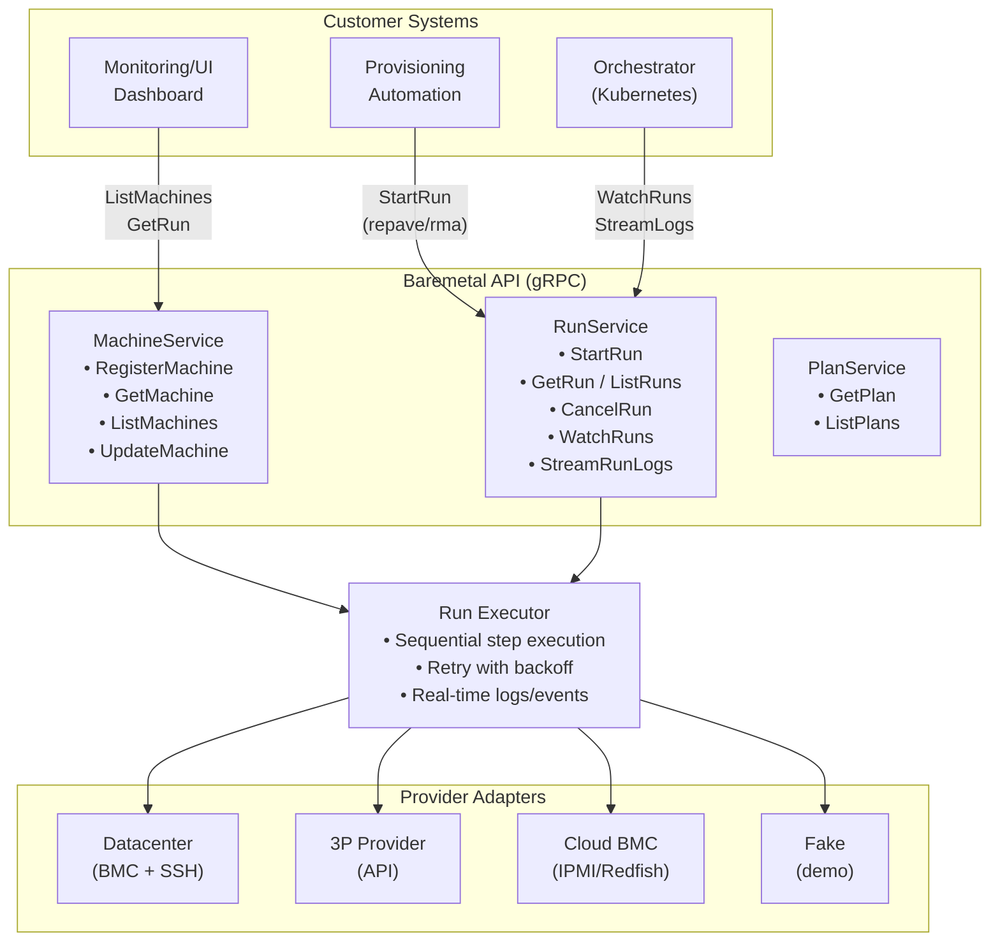
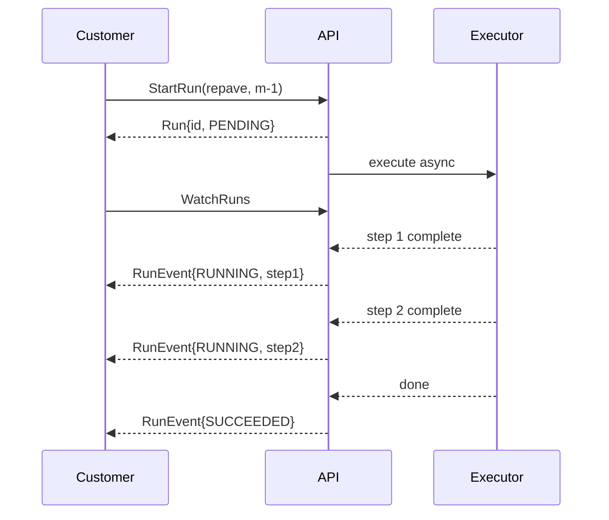
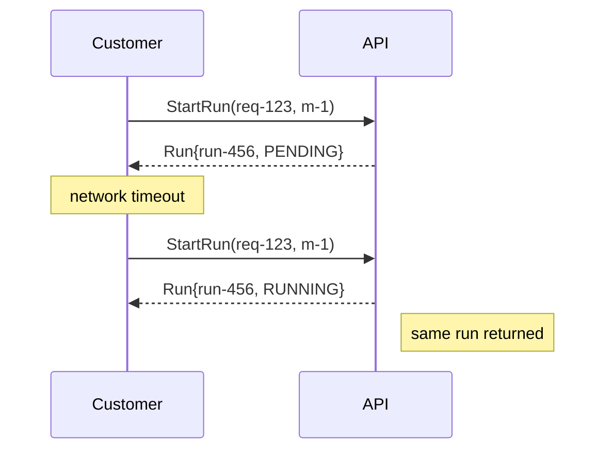
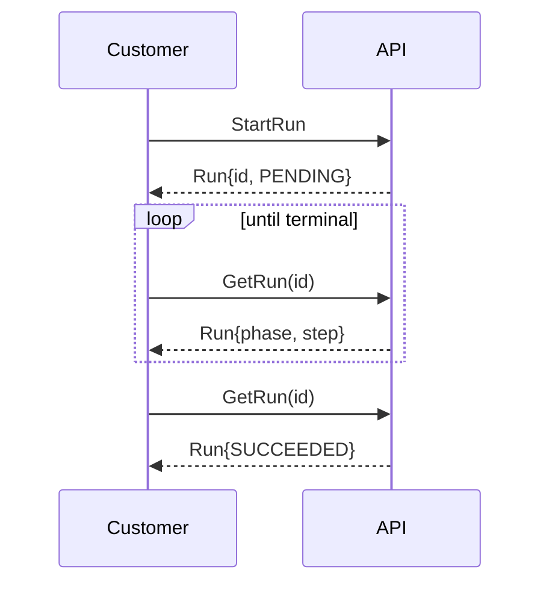

# Bare Metal Provisioning API v1 (gRPC + Hybrid Lifecycle)

## Summary
A minimal, customer-facing gRPC API for managing bare-metal inventory and long-running operations (repave, join, reboot, upgrade, RMA, network reconfig) across multiple providers. The API separates machine identity, reusable plans, and execution runs. Machines expose a small explicit phase plus derived conditions; runs expose step-by-step progress and logs.

## Why this exists
We need a single inventory and operations surface that works across:
- Datacenters we fully control
- Third-party bare-metal providers

The API must support asynchronous operations with observable progress and idempotent retries, while remaining provider-agnostic.

## Goals
- Minimal gRPC API usable by other workstreams
- Async, idempotent operations with observable state (steps + logs)
- Provider-agnostic adapters using capability-based interfaces
- Hybrid lifecycle: explicit phase + derived conditions + computed EffectiveState

## Non-goals (v1)
- Full IPAM/network modeling like MAAS/Ironic
- Workflow DSL (plans are small typed step lists)
- Multi-machine atomic orchestration

---

## Core Concepts

### Machine (customer-visible inventory)
A stable identity plus inventory facts and a minimal explicit lifecycle phase. Conditions are derived asynchronously.

Conceptual fields:
- Identity: `machine_id`, `labels/tags`, `provider`, `location/rack`
- Access hints: `ssh_endpoint`, `bmc_endpoint`, network identifiers (MACs, serial)
- Lifecycle: explicit `phase`, derived `conditions[]`, `active_run_id`
- References: `customer_id`, `target_cluster_ref` (optional)

### Plan (reusable recipe)
A small sequence of typed steps executed in order (e.g., set netboot, repave image, run SSH command). Plans are not a workflow DSL.

Plan details (v1):
- Plan identity: `plan_id` is stable; `display_name` is human readable
- Execution model: steps run strictly in order; stop on first failed step after retries
- Defaults: per-step `timeout_seconds` and `max_retries` inherit from server defaults when unset
- Step naming: `step.name` must be unique within a plan (used for step status lookup)
- Validation: plans are rejected if they contain unknown step kinds or duplicate step names
- Referencing: runs may supply `plan_id` explicitly or use a server-defined default plan per `Run.type`
- Versioning: a plan is immutable once referenced by a run; updates require a new `plan_id`

Sample Step kinds (v1 core):
- `SshCommand`: run an SSH command on the host (via jump/agent as needed)
- `Reboot`: reboot via BMC or in-band, with reachability check
- `SetNetboot`: set next boot device or PXE mode
- `RepaveImage`: install an OS image
- `KubeadmJoin`: run cluster join flow using provided join material
- `VerifyInCluster`: confirm node registration and readiness
- `NetReconfig`: apply network changes (optional in v1)
- `RmaAction`: finalize RMA workflow steps (optional in v1)

### Run (execution record)
An immutable record of applying a plan (or operation type) to a machine. Runs are the customer-facing handle for long-running operations and expose phase, step status, timestamps, and logs.

---

## Lifecycle Model

### Machine Phase (explicit, minimal)
We intentionally keep phases few and avoid an ERROR phase (errors are conditions).

Phases:
- `FACTORY_READY` (arrived w/ base OS + baseline networking)
- `READY` (imported/manageable by us)
- `PROVISIONING` (a run is actively modifying it)
- `IN_SERVICE` (serving workloads in customer cluster)
- `MAINTENANCE` (drained; disruptive ops allowed)
- `RMA` (removed from service for return/replace)
- `RETIRED` (removed from inventory; no ops)

### Conditions (derived truth/health)
Minimal v1 conditions:
- Connectivity: `Reachable`, `BMCReachable`
- Truth: `Provisioned`, `InCustomerCluster`, `Drained`
- Health/attention: `Degraded`, `NeedsIntervention`

### EffectiveState (UI-facing)
Computed on read for a simple, truthful UI state.

Precedence:
1) If `active_run.phase in {PENDING,RUNNING}` => `PROVISIONING`
2) Else if `phase in {RMA, RETIRED, MAINTENANCE}` => `phase`
3) Else if `InCustomerCluster == true` => `IN_SERVICE`
4) Else if `phase == FACTORY_READY` => `FACTORY_READY`
5) Else => `READY`

Overlays:
- `NeedsIntervention=true` => banner
- `Degraded=true` => banner

---

## Run State Machine

Run phases:
- `PENDING -> RUNNING -> (SUCCEEDED | FAILED | CANCELED)`

Step states:
- `WAITING, RUNNING, SUCCEEDED, FAILED`

All step transitions and logs are stored on the Run, not the Machine.

---


## Provider Adapter Model

Providers differ by capabilities; we standardize around Step execution, not provider-specific APIs.

Capability-based interface:
- Inspect/Discover
- PowerControl
- Netboot/PXE
- Imaging/Repave
- RemoteExec (SSH via router/jump)
- ClusterJoin (mint join material + run join)

Run executor behavior:
- Select provider by `machine.provider`
- Execute `plan.steps` sequentially
- Persist step status + logs
- Update `machine.phase` at run boundaries
- Recompute conditions asynchronously

---

## Operational Guarantees

- Idempotency: `StartRun` requires `request_id`; server returns existing Run if replayed
- Concurrency: at most one active Run per machine (DB/lock enforced)
- Recovery: executor resumes from persisted Run step state after crash
- Auditing: all Run transitions + logs preserved

---

## v1 Deliverables

- Proto definitions + Go server skeleton
- Run executor with core step kinds:
  - `SshCommand`, `Reboot`, `SetNetboot`, `RepaveImage`, `KubeadmJoin`, `VerifyInCluster`
- Minimal condition reconciler (`Reachable`, `InCustomerCluster`)

---

## Design Details

### Architecture



### Customer API Interaction Patterns

**1) Trigger-and-observe (async)**



**2) Idempotent retry**



**3) Poll for completion**



---
## gRPC API

### MachineService

```protobuf
service MachineService {
  // Register a new machine or update existing
  rpc RegisterMachine(RegisterMachineRequest) returns (Machine);

  // Get a single machine by ID
  rpc GetMachine(GetMachineRequest) returns (Machine);

  // List all machines with optional filtering
  rpc ListMachines(ListMachinesRequest) returns (ListMachinesResponse);

  // Update machine spec/labels (status is server-managed)
  rpc UpdateMachine(UpdateMachineRequest) returns (Machine);
}

message RegisterMachineRequest {
  Machine machine = 1;  // machine_id optional (auto-generated if empty)
}

message GetMachineRequest {
  string machine_id = 1;
}

message ListMachinesRequest {
  string filter = 1;      // e.g., "phase=IN_SERVICE"
  int32 page_size = 2;
  string page_token = 3;
}

message ListMachinesResponse {
  repeated Machine machines = 1;
  string next_page_token = 2;
}

message UpdateMachineRequest {
  Machine machine = 1;    // Only spec and labels are updated
}
```

### PlanService

```protobuf
service PlanService {
  // Get a plan by ID
  rpc GetPlan(GetPlanRequest) returns (Plan);

  // List all available plans
  rpc ListPlans(ListPlansRequest) returns (ListPlansResponse);
}

message GetPlanRequest {
  string plan_id = 1;
}

message ListPlansRequest {}

message ListPlansResponse {
  repeated Plan plans = 1;
}
```

### RunService

```protobuf
service RunService {
  // Start a run (idempotent with request_id)
  rpc StartRun(StartRunRequest) returns (Run);

  // Get run by ID
  rpc GetRun(GetRunRequest) returns (Run);

  // List runs with optional filtering
  rpc ListRuns(ListRunsRequest) returns (ListRunsResponse);

  // Cancel an active run
  rpc CancelRun(CancelRunRequest) returns (Run);

  // Stream run events (server-streaming)
  rpc WatchRuns(WatchRunsRequest) returns (stream RunEvent);

  // Stream run logs (server-streaming)
  rpc StreamRunLogs(StreamRunLogsRequest) returns (stream LogChunk);
}

message StartRunRequest {
  string request_id = 1;  // Required for idempotency
  string machine_id = 2;  // Target machine
  string type = 3;        // REPAVE, RMA, REBOOT, UPGRADE, NET_RECONFIG
  string plan_id = 4;     // Optional: override default plan for type
}

message GetRunRequest {
  string run_id = 1;
}

message ListRunsRequest {
  string filter = 1;      // e.g., "machine_id=m-1"
}

message ListRunsResponse {
  repeated Run runs = 1;
}

message CancelRunRequest {
  string run_id = 1;
}

message WatchRunsRequest {
  string filter = 1;      // e.g., "machine_id=m-1"
}

message StreamRunLogsRequest {
  string run_id = 1;
}
```

### Core Messages

```protobuf
message Machine {
  string machine_id = 1;
  map<string, string> labels = 2;
  MachineSpec spec = 3;
  MachineStatus status = 4;
}

message MachineSpec {
  string ssh_endpoint = 1;
  string bmc_endpoint = 2;
  string target_cluster_ref = 3;
  repeated string mac_addresses = 4;
}

message MachineStatus {
  Phase phase = 1;
  repeated Condition conditions = 2;
  string active_run_id = 3;

  enum Phase {
    PHASE_UNSPECIFIED = 0;
    FACTORY_READY = 1;
    READY = 2;
    PROVISIONING = 3;
    IN_SERVICE = 4;
    MAINTENANCE = 5;
    RMA = 6;
    RETIRED = 7;
  }
}

message Condition {
  string type = 1;        // Reachable, InCustomerCluster, NeedsIntervention
  bool status = 2;
  string reason = 3;
  google.protobuf.Timestamp last_transition = 4;
}

message Plan {
  string plan_id = 1;
  string display_name = 2;
  repeated Step steps = 3;
}

message Step {
  string name = 1;
  int32 timeout_seconds = 2;
  int32 max_retries = 3;
  oneof kind {
    SshCommand ssh = 10;
    Reboot reboot = 11;
    SetNetboot netboot = 12;
    RepaveImage repave = 13;
    KubeadmJoin join = 14;
    VerifyInCluster verify = 15;
    NetReconfig net = 16;
    RmaAction rma = 17;
  }
}

message Run {
  string run_id = 1;
  string machine_id = 2;
  string request_id = 3;
  string type = 4;
  string plan_id = 5;
  Phase phase = 6;
  repeated StepStatus steps = 7;
  string current_step = 8;
  google.protobuf.Timestamp created_at = 9;
  google.protobuf.Timestamp started_at = 10;
  google.protobuf.Timestamp finished_at = 11;

  enum Phase {
    PHASE_UNSPECIFIED = 0;
    PENDING = 1;
    RUNNING = 2;
    SUCCEEDED = 3;
    FAILED = 4;
    CANCELED = 5;
  }
}

message StepStatus {
  string name = 1;
  State state = 2;
  int32 retry_count = 3;
  google.protobuf.Timestamp started_at = 4;
  google.protobuf.Timestamp finished_at = 5;
  string message = 6;

  enum State {
    STATE_UNSPECIFIED = 0;
    WAITING = 1;
    RUNNING = 2;
    SUCCEEDED = 3;
    FAILED = 4;
  }
}

message RunEvent {
  google.protobuf.Timestamp ts = 1;
  Run snapshot = 2;
  string message = 3;
}

message LogChunk {
  google.protobuf.Timestamp ts = 1;
  string run_id = 2;
  string stream = 3;  // stdout | stderr
  bytes data = 4;
}
```

Pattern: `StartRun` returns a Run handle; clients `WatchRuns` or poll `GetRun` for completion.

---

## Examples

### Machine (sample)

```json
{
  "machine_id": "m-123",
  "labels": {
    "env": "prod",
    "role": "worker",
    "provider": "dc-1"
  },
  "spec": {
    "ssh_endpoint": "10.20.30.40:22",
    "bmc_endpoint": "10.20.30.41",
    "target_cluster_ref": "cluster-a",
    "mac_addresses": ["aa:bb:cc:dd:ee:ff"]
  },
  "status": {
    "phase": "READY",
    "conditions": [
      {"type": "Reachable", "status": true, "reason": "PingOK"},
      {"type": "BMCReachable", "status": true, "reason": "RedfishOK"},
      {"type": "InCustomerCluster", "status": false, "reason": "NotJoined"}
    ],
    "active_run_id": ""
  }
}
```

### Plan (sample)

```json
{
  "plan_id": "plan-repave-ubuntu-2204-v1",
  "display_name": "Repave Ubuntu 22.04 + Join Cluster",
  "steps": [
    {"name": "set-netboot", "timeout_seconds": 60, "max_retries": 2, "netboot": {"mode": "PXE"}},
    {"name": "repave-os", "timeout_seconds": 1800, "max_retries": 1, "repave": {"image": "ubuntu-22.04"}},
    {"name": "reboot", "timeout_seconds": 300, "max_retries": 2, "reboot": {"mode": "bmc"}},
    {"name": "join-cluster", "timeout_seconds": 600, "max_retries": 1, "join": {"cluster_ref": "cluster-a"}},
    {"name": "verify", "timeout_seconds": 300, "max_retries": 0, "verify": {"cluster_ref": "cluster-a"}}
  ]
}
```

### Run (sample)

```json
{
  "run_id": "run-789",
  "machine_id": "m-123",
  "request_id": "req-456",
  "type": "REPAVE",
  "plan_id": "plan-repave-ubuntu-2204-v1",
  "phase": "RUNNING",
  "current_step": "repave-os",
  "steps": [
    {"name": "set-netboot", "state": "SUCCEEDED", "retry_count": 0},
    {"name": "repave-os", "state": "RUNNING", "retry_count": 0}
  ],
  "created_at": "2026-01-29T15:10:00Z",
  "started_at": "2026-01-29T15:10:05Z",
  "finished_at": null
}
```

Notes:
- Example step payloads show shape only; actual step message fields are defined in the proto.
- Timestamps are RFC 3339 for readability; protobuf uses `google.protobuf.Timestamp`.

---


## Key Design Decisions

1) Separation of concerns
- Machine = identity + inventory + lifecycle state
- Plan = reusable recipe (sequence of typed steps)
- Run = execution record for a plan on a machine

2) Hybrid lifecycle
- Explicit phase for operator intent (7 states)
- Conditions for derived truth (Reachable, InCustomerCluster, etc.)
- EffectiveState computed at read time with clear precedence rules

3) Idempotency
- `request_id` scoped to `(machine_id, request_id)`
- Same request returns existing Run, never creates duplicate
- Essential for safe retries in distributed systems

4) Single active run per machine
- Prevents conflicting operations
- Enforced at store level with atomic check-and-set

5) Async execution with streaming
- StartRun returns immediately with Run handle
- Executor runs asynchronously with long-lived context
- Real-time logs/events via gRPC streaming

6) Store immutability
- All reads return cloned protos
- Writes clone inputs before storing
- Prevents data races from external mutation

7) Provider abstraction
- Capability-based interface, not monolithic
- Easy to swap fake (demo) vs real (BMC, SSH, Ansible)
- Step execution delegated to provider methods

8) Context lifecycle
- Run execution uses long-lived server context, not RPC context
- Runs survive after StartRun RPC returns
- Graceful shutdown cancels all active runs

---

## Error Handling

| Error | gRPC Code | Behavior |
|-------|-----------|----------|
| Machine not found | NOT_FOUND | Request rejected |
| Machine has active run | FAILED_PRECONDITION | Request rejected |
| Plan not found | NOT_FOUND | Request rejected |
| Step fails after retries | - | Run → FAILED, Machine → MAINTENANCE |
| Run canceled | - | Run → CANCELED, Machine → MAINTENANCE |

---
