# Baremetal Provisioning API & UX Design

**Status:** Draft  
**Authors:** Stargate Team  
**Last Updated:** January 30, 2026  
**Reviewers:** [Team]

---

## Executive Summary

This document describes the customer-facing gRPC API and user experience for managing baremetal machines across datacenters and third-party providers. The API prioritizes simplicity, safety, and observability while hiding internal workflow complexity from SDK consumers.

**Key principles:**
- Minimal, stable API surface that won't break as internals evolve
- Safety gates to prevent accidental destructive operations
- Real-time observability via streaming logs and events
- Idempotent operations for safe retries in distributed systems

---

## Table of Contents

1. [Goals & Non-Goals](#goals--non-goals)
2. [Core Concepts](#core-concepts)
3. [Lifecycle Model](#lifecycle-model)
4. [API Surface](#api-surface)
5. [Key Design Decisions](#key-design-decisions)
6. [Design Rationale](#design-rationale)
7. [UX Patterns](#ux-patterns)
8. [Error Handling](#error-handling)
9. [Examples](#examples)
10. [Open Questions](#open-questions)

---

## Goals & Non-Goals

### Goals

| Goal | Rationale |
|------|-----------|
| **Minimal gRPC API** | Two services (MachineService, OperationService) cover all customer needs |
| **Async operations with observability** | Long-running work returns immediately; progress via streaming |
| **Idempotent retries** | Network failures are common; same request = same result |
| **Provider-agnostic** | Works across owned datacenters and 3P bare-metal providers |
| **Safety gates** | Destructive operations (reimage) require explicit maintenance mode |
| **Backend-owned status** | Prevents clients from corrupting machine state |

---

## Core Concepts

### Machine

A stable identity representing a physical server in inventory.

```mermaid
classDiagram
    class Machine {
        +string machine_id
        +map~string,string~ labels
        +MachineSpec spec
        +MachineStatus status
    }
    class MachineSpec {
        «client-updatable»
        +string ssh_endpoint
        +string bmc_endpoint
        +string target_cluster_ref
        +string[] mac_addresses
    }
    class MachineStatus {
        «backend-owned, read-only»
        +Phase phase
        +EffectiveState effective_state
        +string active_operation_id
        +Condition[] conditions
    }
    Machine --> MachineSpec
    Machine --> MachineStatus
```



**Example:**
| Field | Value |
|-------|-------|
| machine_id | `m-abc123` |
| labels | `{env: "prod", rack: "r42", provider: "dc-east"}` |
| spec.ssh_endpoint | `10.20.30.40:22` |
| status.phase | `READY` |
| status.effective_state | `IDLE` |
| status.conditions | `[Provisioned=✓, Reachable=✓]` |

**Important:** Clients can update `Spec` and `Labels` via `UpdateMachine`. All `Status` fields (phase, effective_state, conditions, active_operation_id) are backend-owned and protected from client updates.

### Operation

An immutable record of work performed on a machine.


**Example (in-progress reimage):**
| Field | Value |
|-------|-------|
| operation_id | `op-789xyz` |
| machine_id | `m-abc123` |
| request_id | `req-456` |
| type | `REIMAGE` |
| phase | `RUNNING` |
| params | `{image_ref: "ubuntu-2204"}` |

**Operation Types:**
| Type | Description | Required Phase |
|------|-------------|----------------|
| `REBOOT` | Reboot the machine | READY or MAINTENANCE |
| `REIMAGE` | Full OS reimage/repave | MAINTENANCE only |
| `ENTER_MAINTENANCE` | Transition to maintenance mode | Any |
| `EXIT_MAINTENANCE` | Return to READY | MAINTENANCE |

**Operation Phases:**


---

## Lifecycle Model

### The Dual-State Model

We use a **hybrid lifecycle** with two complementary views:

| Concept | Purpose | Mutability |
|---------|---------|------------|
| **Phase** | Imperative intent gate | Changed only by explicit API calls |
| **EffectiveState** | Observed reality for UIs | Computed on read, never set directly |

This separation prevents "state explosion" while maintaining truthful visibility.

### Phase (Imperative Intent)

Phase represents what the operator **intends** for the machine. It gates which operations are allowed.


| Phase | Meaning | Allowed Operations |
|-------|---------|-------------------|
| `FACTORY_READY` | New, never provisioned | enter-maintenance |
| `READY` | Provisioned, in service | reboot, enter-maintenance |
| `MAINTENANCE` | Out of service | reboot, reimage, exit-maintenance |

**Key behavior:** Phase does NOT change on failures or cancellations. Only explicit `EnterMaintenance` and `ExitMaintenance` API calls modify phase.

### EffectiveState (Observed Reality)

EffectiveState is computed server-side and answers: "What is this machine doing right now?"

```mermaid
flowchart TD
    A[Evaluate Machine] --> B{Retired OR RMA?}
    B -->|Yes| BLOCKED["🔴 BLOCKED"]
    B -->|No| C{NeedsIntervention?}
    C -->|Yes| ATTENTION["🟠 ATTENTION"]
    C -->|No| D{Active Operation?}
    D -->|Yes| BUSY["🔵 BUSY"]
    D -->|No| E{Phase?}
    E -->|MAINTENANCE| MAINTENANCE["🟡 MAINTENANCE"]
    E -->|FACTORY_READY| NEW["⚪ NEW"]
    E -->|READY| IDLE["🟢 IDLE"]
```



| EffectiveState | UI Treatment | User Action |
|----------------|--------------|-------------|
| `NEW` | Gray, needs setup | Enter maintenance, reimage |
| `IDLE` | Green, healthy | Ready for work |
| `BUSY` | Blue, working | Wait or cancel |
| `MAINTENANCE` | Yellow, out of service | Reimage, then exit |
| `ATTENTION` | Orange, needs help | Investigate, remediate |
| `BLOCKED` | Red, unusable | RMA or decommission |

### Conditions

Boolean signals on machine status that influence EffectiveState:

| Condition | Meaning |
|-----------|---------|
| `Reachable` | Machine responds to health checks |
| `Provisioned` | Successfully imaged at least once |
| `InCustomerCluster` | Joined target Kubernetes cluster |
| `NeedsIntervention` | Requires operator attention (failure) |
| `OperationCanceled` | Last operation was canceled |
| `RMA` | Flagged for return/replacement |
| `Retired` | Permanently decommissioned |

---

## API Surface

### MachineService

All machine inventory and lifecycle operations.

```protobuf
service MachineService {
  // === Inventory ===
  rpc RegisterMachine(RegisterMachineRequest) returns (Machine);
  rpc GetMachine(GetMachineRequest) returns (Machine);
  rpc ListMachines(ListMachinesRequest) returns (ListMachinesResponse);
  rpc UpdateMachine(UpdateMachineRequest) returns (Machine);
  
  // === Lifecycle Operations ===
  rpc RebootMachine(RebootMachineRequest) returns (Operation);
  rpc ReimageMachine(ReimageMachineRequest) returns (Operation);
  rpc EnterMaintenance(EnterMaintenanceRequest) returns (Operation);
  rpc ExitMaintenance(ExitMaintenanceRequest) returns (Operation);
  rpc CancelOperation(CancelOperationRequest) returns (Operation);
}
```

### OperationService

Read-only observability into operations.

```protobuf
service OperationService {
  rpc GetOperation(GetOperationRequest) returns (Operation);
  rpc ListOperations(ListOperationsRequest) returns (ListOperationsResponse);
  rpc WatchOperations(WatchOperationsRequest) returns (stream OperationEvent);
  rpc StreamOperationLogs(StreamOperationLogsRequest) returns (stream LogChunk);
}
```

### Key Message Types

```protobuf
message Machine {
  string machine_id = 1;
  map<string, string> labels = 2;
  MachineSpec spec = 3;           // Client-updatable
  MachineStatus status = 4;       // Backend-owned, read-only
}

message Operation {
  string operation_id = 1;
  string machine_id = 2;
  string request_id = 3;          // For idempotency
  OperationType type = 4;
  Phase phase = 5;
  map<string, string> params = 6;
  ErrorStatus error = 7;
  // Timestamps: created_at, started_at, finished_at
}
```

### Request Messages

```protobuf
// Machine CRUD
message RegisterMachineRequest {
  Machine machine = 1;            // machine_id optional (auto-generated if empty)
}

message GetMachineRequest {
  string machine_id = 1;
}

message UpdateMachineRequest {
  Machine machine = 1;            // Only spec and labels are updated; status ignored
}

// Lifecycle Operations
message RebootMachineRequest {
  string machine_id = 1;
  string request_id = 2;          // Required for idempotency
}

message ReimageMachineRequest {
  string machine_id = 1;
  string request_id = 2;          // Required for idempotency
  string image_ref = 3;           // OS image identifier (e.g., "ubuntu-2204", "rhel-9")
}

message EnterMaintenanceRequest {
  string machine_id = 1;
  string request_id = 2;          // Required for idempotency
}

message ExitMaintenanceRequest {
  string machine_id = 1;
  string request_id = 2;          // Required for idempotency
}

message CancelOperationRequest {
  string operation_id = 1;
}
```

### Operation Parameters

Parameters passed via request fields are stored in `Operation.params` for auditing:

| Operation | Parameter | Description |
|-----------|-----------|-------------|
| `REIMAGE` | `image_ref` | OS image identifier (e.g., `ubuntu-2204`, `rhel-9`) |

---

## Key Design Decisions

### D1: Status is Backend-Owned

**Decision:** `UpdateMachine` only accepts `Spec` and `Labels`. All status fields are protected.

**Rationale:** The executor/backend updates status as operations progress. If clients could write status, concurrent updates would corrupt machine state (e.g., clobbering `active_operation_id` or `conditions` during an operation).

**Impact:**
- ✅ Prevents race conditions between client updates and executor
- ✅ Status is always consistent with actual machine state
- ❌ Clients cannot set arbitrary conditions (by design)

### D2: Reimage Requires Maintenance

**Decision:** `ReimageMachine` returns `FAILED_PRECONDITION` unless phase is `MAINTENANCE`.

**Rationale:** Reimaging is destructive. Requiring explicit maintenance entry prevents accidental reimages of production machines.

**Impact:**
- ✅ Safety gate for destructive operations
- ✅ Forces operators to consciously drain before reimaging
- ❌ Two API calls required (enter-maintenance, then reimage)

### D3: Phase is Imperative Intent

**Decision:** Failures and cancellations do NOT change phase. Only explicit API calls modify phase.

**Rationale:** Phase represents operator intent, not system state. If a reimage fails, the operator still intends for the machine to be in maintenance until they explicitly exit.

**Impact:**
- ✅ Clear separation of intent vs. observed state
- ✅ Failures set `NeedsIntervention=true` (condition) not phase change
- ❌ Requires checking EffectiveState for UI, not just Phase

### D4: Idempotency via Request ID

**Decision:** All operation RPCs require `request_id` scoped to `(machine_id, request_id)`.

**Rationale:** Network failures are common. Clients must be able to safely retry without creating duplicate operations.

**Impact:**
- ✅ Safe retries in distributed systems
- ✅ No duplicate work on replay
- ❌ Clients must generate and track request IDs

### D5: Single Active Operation Per Machine

**Decision:** Store enforces at most one active operation per machine.

**Rationale:** Concurrent operations on the same machine would conflict (e.g., reboot during reimage).

**Impact:**
- ✅ Prevents conflicting operations
- ✅ Simple mental model
- ❌ Must wait for current operation to complete or cancel

---

## Design Rationale

### Explicit Maintenance Mode

Reimaging destroys all data on the machine. Requiring explicit maintenance entry forces operators to consciously acknowledge the destructive action. Without this gate, automation bugs could accidentally reimage production machines actively serving traffic.

The API also doesn't own the drain process. Customers have their own processes—Kubernetes cordon/drain, load balancer removal, database failover, graceful app shutdown. Making maintenance explicit lets customers integrate their drain logic *before* calling the API.

Additionally, operators often want to do multiple things while in maintenance:
```bash
enter-maintenance machine-1
reimage machine-1 --image ubuntu-2204
reboot machine-1              # verify it comes back
# run custom validation scripts
exit-maintenance machine-1
```
Auto-entering/exiting would require re-draining for each operation.

Finally, there's a clear audit trail: "User X put machine-1 into maintenance at 10:00."

---

### Failures Don't Change Phase

Phase represents **operator intent**, not system state. If a reimage fails, the operator still *intends* for the machine to be in maintenance until they explicitly exit.

The failure is captured via the `NeedsIntervention=true` condition, and EffectiveState becomes `ATTENTION` (visible in UIs). The operator can retry the operation or investigate without phase gymnastics.

This avoids the common anti-pattern of "stuck in ERROR state" that plagues many lifecycle systems.

---

### Backend-Owned Status

The status fields (phase, effective_state, conditions, active_operation_id) are protected from client updates because:

1. **Race conditions:** If a client updates status while an operation is running, it could clobber the executor's updates (e.g., clearing `active_operation_id` mid-operation)
2. **Consistency:** Status should reflect actual machine state, not what a client claims
3. **Single source of truth:** The backend/executor is the authority on machine state

For RMA/Retired flags, we recommend a separate admin API or direct database access for privileged systems—not the standard UpdateMachine path.

---

### Explicit Request ID for Idempotency

Timestamp-based deduplication doesn't work: timestamps have precision issues and clock skew, two legitimate operations seconds apart would collide, and the client knows whether they're retrying vs. starting new work.

With explicit `request_id`:
- Client generates a UUID or meaningful ID (e.g., `deploy-v2.1-machine-1`)
- Same `request_id` = "I'm retrying the same logical operation"
- Different `request_id` = "This is a new operation"

This is the standard pattern used by AWS, GCP, and other cloud APIs.

---

## UX Patterns

### CLI Design

```
bmdemo-cli <command> [args]

Commands:
  import <N>              Register N machines
  list                    Show machines with phase, effective state, conditions
  reboot <machine-id>     Reboot a machine
  reimage <machine-id>    Reimage (requires MAINTENANCE)
  enter-maintenance <id>  Enter maintenance mode
  exit-maintenance <id>   Exit maintenance mode
  ops                     List all operations
  watch [machine-id]      Stream operation events
  logs <operation-id>     Stream operation logs
  cancel <operation-id>   Cancel active operation
```

### List Output

The `list` command shows the dual-state model clearly:

```
MACHINE_ID   PHASE        EFFECTIVE   REACHABLE  PROVISIONED  ACTIVE_OP
machine-1    READY        IDLE        ✓          ✓            -
machine-2    MAINTENANCE  BUSY        ✓          ✓            op-abc...
machine-3    READY        ⚠ATTENTION  ✓          ✓            -
machine-4    READY        ⛔BLOCKED   -          -            -
```

### Sample Streaming Output

The CLI subscribes to two gRPC streams simultaneously:

| Stream | Source | Shows |
|--------|--------|-------|
| `WatchOperations` | Operation phase changes | `→ Starting...` / `✓ Complete` |
| `StreamOperationLogs` | Real-time execution logs | `│ [tag] message` |

**Example output (events and logs interleaved):**

```
┌─────────────────────────────────────────────────────────────
│ Operation: op-abc123
│ Machine: machine-1
│ Type: REIMAGE
│ Phase: MAINTENANCE → EffectiveState: BUSY
└─────────────────────────────────────────────────────────────

→ Setting netboot...                          ← EVENT: phase update
│ [netboot] Configuring PXE for ubuntu-2204   ← LOG: execution detail
│ [netboot] DHCP updated                      ← LOG: execution detail
✓ Netboot configured                          ← EVENT: step complete

→ Rebooting machine...                        ← EVENT: phase update
│ [reboot] Sending IPMI reset command         ← LOG: execution detail
│ [reboot] Waiting for machine to come back   ← LOG: execution detail
✓ Reboot complete                             ← EVENT: step complete

→ Repaving...                                 ← EVENT: phase update
│ [repave] Writing image ubuntu-2204          ← LOG: execution detail
│ [repave] Progress: 45%                      ← LOG: execution detail
│ [repave] Progress: 90%                      ← LOG: execution detail
│ [repave] Image written successfully         ← LOG: execution detail
✓ Repave complete                             ← EVENT: step complete

┌─────────────────────────────────────────────────────────────
│ ✓ SUCCEEDED
│ Duration: 4m 32s
└─────────────────────────────────────────────────────────────

Machine state after operation:
┌─────────────────────────────────────────────────────────────
│ Phase: MAINTENANCE (unchanged)
│ EffectiveState: MAINTENANCE (was BUSY)
│ Conditions: Provisioned=✓, InCustomerCluster=✓ (newly set)
│ ActiveOperationId: (cleared)
└─────────────────────────────────────────────────────────────
```

Events and logs arrive asynchronously, so they may interleave in any order.

### Idempotent Retry Pattern

```
# First request
$ bmdemo-cli reimage machine-1 --request-id=deploy-v2.1
Operation: op-abc123 (PENDING → RUNNING → SUCCEEDED)

# Retry with same request-id (safe!)
$ bmdemo-cli reimage machine-1 --request-id=deploy-v2.1
Operation: op-abc123 (SUCCEEDED)  ← Same operation, no new work
```

---

## Error Handling

### gRPC Error Codes

| Scenario | gRPC Code | Example |
|----------|-----------|---------|
| Machine not found | `NOT_FOUND` | GetMachine("nonexistent") |
| Wrong phase for operation | `FAILED_PRECONDITION` | ReimageMachine when READY |
| Machine has active operation | `FAILED_PRECONDITION` | Start op while one is running |
| Operation already finished | `FAILED_PRECONDITION` | Cancel SUCCEEDED operation |
| Missing required field | `INVALID_ARGUMENT` | ReimageMachine without request_id |

### Failure Behavior

When an operation fails:

1. Operation phase → `FAILED`
2. `error` field populated with code, message, and details
3. `NeedsIntervention` condition set to `true`
4. Machine EffectiveState → `ATTENTION`
5. Machine Phase **unchanged** (still MAINTENANCE or READY)

```json
{
  "operation_id": "op-failed-123",
  "phase": "FAILED",
  "error": {
    "code": "EXECUTION_FAILED",
    "message": "SSH connection refused after 3 retries",
    "retryable": true
  }
}
```

### Cancellation Behavior

When an operation is canceled:

1. Operation phase → `CANCELED`
2. `OperationCanceled` condition set (not `NeedsIntervention`)
3. Machine Phase **unchanged**
4. In-progress work is stopped gracefully

---

## Examples

### Example 1: Reimage a Machine

```bash
# Step 1: Enter maintenance (safety gate)
$ bmdemo-cli enter-maintenance machine-1
Operation: op-111 SUCCEEDED

# Step 2: Reimage
$ bmdemo-cli reimage machine-1 --image ubuntu-2204
Operation: op-222 RUNNING...
✓ SUCCEEDED

# Step 3: Exit maintenance
$ bmdemo-cli exit-maintenance machine-1
Operation: op-333 SUCCEEDED

# Result: machine-1 is READY with Provisioned=true
```

### Example 2: Handle a Failed Operation

```bash
# Operation fails
$ bmdemo-cli reimage machine-1
Operation: op-444 FAILED
Error: SSH connection refused

# Check machine state
$ bmdemo-cli list
MACHINE_ID   PHASE        EFFECTIVE   CONDITIONS
machine-1    MAINTENANCE  ⚠ATTENTION  NeedsIntervention=✓

# Investigate and fix the issue, then retry
$ bmdemo-cli reimage machine-1 --request-id=retry-001
Operation: op-555 SUCCEEDED

# Machine recovers
$ bmdemo-cli list
MACHINE_ID   PHASE        EFFECTIVE   CONDITIONS
machine-1    MAINTENANCE  MAINT       Provisioned=✓
```

### Example 3: Watch Operations Across Fleet

```bash
# Stream all operation events
$ bmdemo-cli watch
[10:00:01] machine-1  op-111  ENTER_MAINTENANCE  PENDING
[10:00:02] machine-1  op-111  ENTER_MAINTENANCE  RUNNING
[10:00:05] machine-1  op-111  ENTER_MAINTENANCE  SUCCEEDED
[10:00:10] machine-2  op-222  REBOOT             PENDING
[10:00:11] machine-2  op-222  REBOOT             RUNNING
...
```
